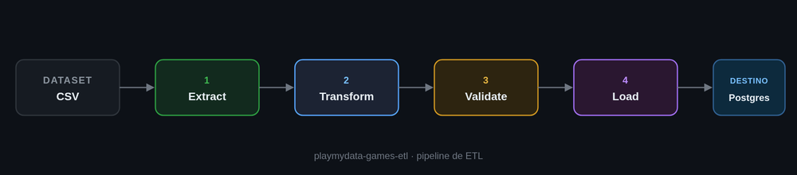
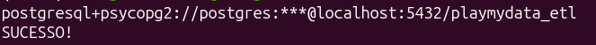

# 🎮 PlayMyData ETL v1

Pipeline em Python que extrai, organiza e carrega dados de jogos de PC num banco PostgreSQL. Projeto de estudo pra praticar ETL do início ao fim.



## Como usar

1. **Clone o repositório**

>git clone https://github.com/thiagoferlopes/playmydata-games-etl.git

>cd playmydata-games-etl


2. **Baixe o dataset**

O CSV com os dados dos jogos não vem junto no repositório — ele é grande demais, então a pasta `data/raw` está no `.gitignore`. Esse passo você faz na mão:

>- Baixe o arquivo `all_games_PC.csv` (29 MB) direto daqui: https://zenodo.org/records/10262075/files/all_games_PC.csv?download=1

>- Crie a pasta `data/raw` (se ela ainda não existir) e coloque o arquivo baixado lá dentro

No final, o caminho precisa ficar assim:
```
data/raw/all_games_PC.csv
```

3. **Crie o ambiente virtual e instale as dependências**

>python3 -m venv .venv

>source .venv/bin/activate

>pip install -r requirements.txt


4. **Crie o banco e a tabela no PostgreSQL**

>psql -U postgres -d postgres -f sql/create_database.sql

>psql -U postgres -d playmydata_etl -f sql/create_table.sql


5. **Configure o `.env`**

Crie um arquivo `.env` na raiz do projeto com suas credenciais do banco:
```
DB_USER=seu_usuario
DB_PASSWORD=sua_senha
DB_HOST=localhost
DB_PORT=5432
DB_NAME=playmydata_etl
```

6. **Rode o pipeline**

>python3 src/main.py


 
Se aparecer `SUCESSO!` no terminal, os dados foram carregados. 🎉

<!-- print do terminal com o "SUCESSO!" -->
<!--  -->

## 🔍 O que o pipeline verifica

Antes de carregar os dados, ele confere se:

- não tem ID ou nome vazio
- não tem ID repetido
- as notas dos jogos estão entre 0 e 100
- não tem número negativo nas colunas de horas

Se algo estiver errado, nada é carregado — o motivo fica registrado em `logs/pipeline.log`.


## ⚠️ O que ainda não está redondo

Esse é um projeto de estudo (primeira versão), então tem coisas pra melhorar:

- a carga usa `to_sql(if_exists="replace")`, que recria a tabela toda vez — por isso a `PRIMARY KEY` do `create_table.sql` acaba se perdendo
- ainda não tem testes automatizados
- só funciona com um CSV por vez, sem carga incremental
